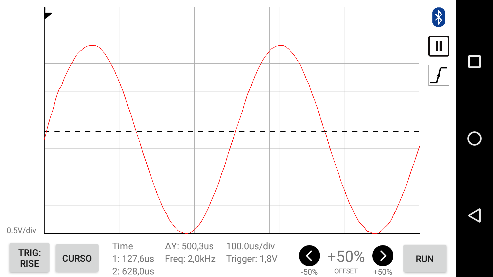
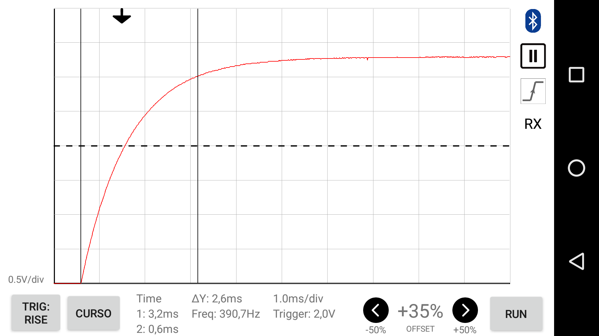

# Oscilloscope graphical interface application

This application was developed for a graduation project for the Computer Enginnering 
course at 
University of São Paulo (USP), São Carlos campus. The title of the project is 
*Implementation of a low cost Oscilloscope with graphical display on an Android 
application*, and the final report (in Brazilian Portuguese) is available 
[here](http://www.tcc.sc.usp.br/tce/disponiveis/97/970010/tce-04012017-163919/).

This Android application is used for viewing the waveform of the input signal of 
the hardware unity ([repository](https://github.com/jeajjr/tcc-arm)). Communication 
with that unity is done through a Bluetooth connection, SPP profile.

Some functionalities were implemented based on the ones found on a commercial 
oscilloscope, such as triggering, variable time display scale and adjustable 
holdoff time, all accessible and configurable through the mobile application.

## Screenshots

2kHz sine wave:

Charging a 1μF capacitor in series with a 1kΩ with a 3V step pulse:

